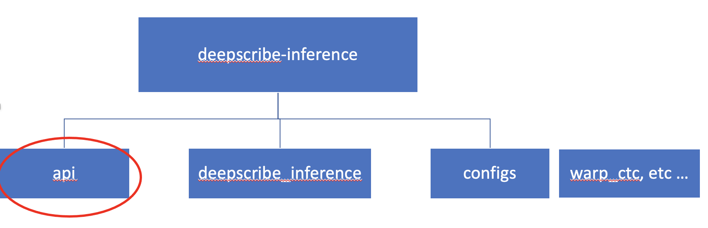

# Transcriber API

This repository provides an interface to the transcription engine (e.g. DeepScribe).

The API script is called transcribers.py and is in a folder called 'api'. Required transcriber modules are imported to the class for the transcriber. For example, DeepScribe modules are imported into the 'deepscribe' class.

Configuration files can be supplied for a variety of combinations of languages and transcriber engines (e.g. deepscribe, wav2vec, HuBERT) as they become available. A set of example files is provided using the dev area location references.

## Dependencies

Dependencies required to run the library in production should be noted in the `install_requires` section of `setup.py`.

Dependencies required to test the library or for development purposes only, should be noted in the `dev` section of `extras_require` in `setup.py`

*Do not create or use requirements.txt*. This is not supported for automated builds and having dependencies specified in more than once place is a maintaince problem.

## Building

Before pushing any code you should ensure it builds and passes tests.
To do this run the following command

    make python-transcriber-api

The above step does a number of tasks:
1. Creates a builder docker image with cmake installed
    * This is required to build `sentencepiece`, which is a dependency of this library. 
    * The docker image will also install all the required dependencies for this python library in advance of building the actual python wheel. Locally, this will mean that if the python build fails, all the dependencies won't need to be redownloaded and installed again once the code is fixed; they are cached in the docker image.
    * *Any* change to `setup.py` will invalidate this cache and result in the docker image being rebuilt. If no changes are made to `setup.py` between rebuilds then the docker image will use the cached layers and build immediately.
1. Download english models, in preparation for testing.
1. Download english audio, in preparation for testing.
1. Build the python wheel for this library, using the docker image from point 1.
    * Building includes packaging, unit tests, code coverage, code analysis and security analysis.
1. In CICD, the resultant artifact will be published to artifactory, this will not happen for local developer builds.

## Local/Developer Installation

Ensure you are using python 3.6.
You can either install from the wheel produced in the previous *Building* section, otherwise you can do:

    python3 -m venv venv
    source venv/bin/activate
    pip3 install -e .[dev]

Note: The first step is only ever required the first time you clone and do the first installation and can be ignored in followed installations.

Linux is the supported operating system for this library. All dependencies for this library are supported and linux and should be available on artifactory. If you are not using Linux (for example MacOS), you may have to build some of the dependencies yourself. 

To run tests:
    
    bash download_english_models.sh
    bash download_test_data.sh
    pytest -v --cov-branch --cov-report=term --cov=. --cov-report=term

## Running Transcriptions

The transcriptions can be run as follows:

•	Configuration settings / overrides are delivered to the API when loaded. 
In the example below, settings for English transcription are in a file called 'english.yaml' and stored in the variable 'settings'.

These values are then used on the files to be transcribed in the form transcriber.predict()

	cfg = DeepscribeConfig(
            decoder=DeepscribeDecoderConfig(
                lm_path = "path/to/lm.trie"
            ),
            model=DeepscribeModelConfig(
                model_path="path/to/model.pth"
            ),
            text_postprocessing=DeepscribeTextPostProcessingConfig(
                punc_path="path/to/punc.pth",
                acronyms_path="path/to/acronyms.txt"
            )
        )

•	These are then loaded and used to run the predict method on the files supplied.

	transcriber = cfg.load()

	result=transcriber.predict(['/path/to//audio_file1.wav','/path/to//audio_file1.wav'])  #List of files

or
	
	result=transcriber.predict(['/path/to//audio/files/directory/'])  #Directory containing audio files

•   predict() returns a TranscriptionResult.

        @dataclass
        class TranscriptionToken:
            text: str
            start_time: int
            end_time: int

        @dataclass
        class TranscriptionResult:
            tokens: Iterable[TranscriptionToken]

        Example of result:

        TranscriptionResult(
            tokens=[
                TranscriptionToken(text='cat', start_time=12, end_time=45),
                TranscriptionToken(text='in', start_time=48, end_time=56),
                TranscriptionToken(text='the', start_time=60, end_time=66),
                TranscriptionToken(text='hat', start_time=72, end_time=84)
            ])

•	The various model parameters can be changed as in the configuration objects:

	
	class DeepscribeDecoderConfig(BaseModel):
        lm_path = ''   # Path to an (optional) kenlm language model for use with beam search
        alpha = 0.39 # Language model weight Default is tuned for English
        beta = 0.45  # Language model word bonus (all words) Default is tuned for English
        cutoff_top_n = 40    # Keep top cutoff_top_n characters with highest probs in beam search
        cutoff_prob = 1.0  # Cutoff probability in pruning. 1.0 means no pruning
        lm_workers = 8  # Number of LM processes to use for beam search
        beam_width = 32 # Beam width to use for beam search

    class DeepscribeTextPostProcessingConfig(BaseModel):
        punc_path = ''  # Path to a DeepScribe Punctuation model
        acronyms_path = ''  # Path to acronym whitelist (collapse and capitalize)

    class DeepscribeModelConfig(BaseModel):
        model_path = ''  # Path to acoustic model

    class DeepscribeHardwareConfig(BaseModel):
        cuda = True  # Use CUDA for inference

    class DeepscribeConfig(TranscriberConfig):
        decoder = DeepscribeDecoderConfig()
        text_postprocessing = DeepscribeTextPostProcessingConfig()
        model = DeepscribeModelConfig()
        hardware = DeepscribeHardwareConfig()

FAQ:

Setup fails with:

    ERROR: Could not find a version that satisfies the requirement deepscribe-inference==0.3.3 (from versions: none)
    
    ERROR: No matching distribution found for deepscribe-inference==0.3.3

Try the following three steps:

• Ensure python is version 3.6 with the following command:

    python --version

• Ensure you have exported your artifactory username and API key

    export ARTIFACTORY_USERNAME=username
    export ARTIFACTORY_PASSWORD=to_your_artifactory_api_key_in_your_artifactory_profile

• Ensure ~/.pip/pip.conf looks like:

    [global]
    index-url = https://<username>:<api-key>@artifacts.corp.digitalreasoning.com/artifactory/api/pypi/pypi-labs-releases-local/simple